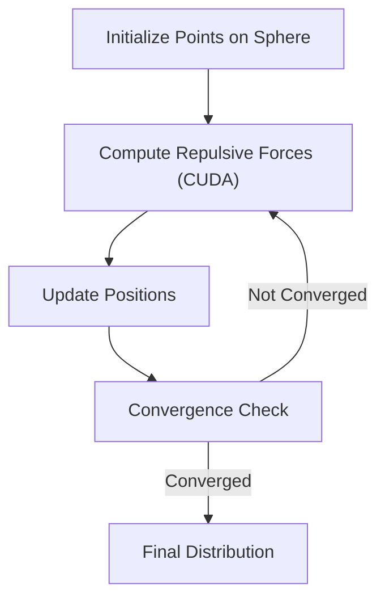
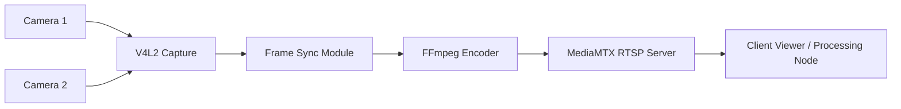
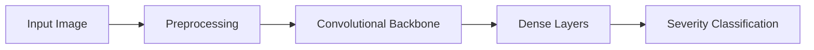

# Brent A. Thorne

**Embedded Systems Engineer • Scientific Computing Specialist • R&D Platform Architect**  
_Firmware + Drivers • Real-Time Sensing • HPC Optimization • Applied AI_


---

# 🌐 What I Do

I build intelligent, resilient systems at the intersection of **embedded firmware**, **real-time sensing**, and **scientific computing**. My work focuses on:

- **Embedded Linux drivers** and hardware integration (I2C, SPI, UART, CAN)  
- **Real-time video + sensor acquisition pipelines** (GStreamer, V4L2, FFmpeg)  
- **AI/ML deployment** in constrained environments (PyTorch, CUDA)  
- **Scientific DevOps**: reproducible CI/CD, Docker, GitHub Actions  
- **HPC acceleration** with SIMD (AVX2), OpenMP, MPI, and custom CUDA kernels  

I specialize in projects requiring **low-level insight** and **high-level systems thinking**.

---

# 🧠 Featured Projects

Below are **project cards** with **architecture diagrams** (Mermaid) to illustrate system design and data flow.  
Repositories are private but **available upon request**.

---

## 🔷 Project: Spectral Radar Decomposition Driver (Kernel-Space)

Developed a Linux kernel driver for a radar module streaming high-rate ADC data via DMA into real-time FFT engines.

**Impact:**  
Enabled low-latency RF signal capture and spectral decomposition for imaging and diagnostics.

**Tech:**  
C, Kernel Modules, DMA, mmap, FFTW

**Repo:** Private repo available upon request

### Architecture Diagram
```mermaid
flowchart LR
    ADC[High-Rate ADC] --> DMA[DMA Engine]
    DMA --> KMOD[Kernel Driver]
    KMOD --> RB[Ring Buffer (mmap)]
    RB --> FFT[User-Space FFT Engine]
    FFT --> APP[Analysis Application]
```

---

## 🔷 Project: Sphere Point Distribution for Agent Initialization

Generated uniform and quasi-uniform spherical distributions using Fibonacci, geodesic, and Lissajous curves with CUDA-accelerated force modeling.

**Impact:**  
Optimized initialization for agent-based simulations and volumetric analysis.

**Tech:**  
CUDA, Python, AVX2, Matplotlib

**Repo:** Private repo available upon request

### Algorithm Diagram


---

## 🔷 Project: Multi-Camera Real-Time Pipeline (V4L2 + RTSP)

Built synchronized multi-camera acquisition with low-latency streaming via MediaMTX.

**Impact:**  
Supports embedded vision applications on constrained compute platforms.

**Tech:**  
V4L2, FFmpeg, MediaMTX, GStreamer

**Repo:** Private repo available upon request

### Pipeline Diagram


---

## 🔷 Project: Disaster Image Severity Classification (CNNs)

Fine-tuned convolutional models to classify damage severity from crisis imagery.

**Impact:**  
Explored multimodal cues for humanitarian response modeling.

**Tech:**  
PyTorch, TensorFlow, NumPy, OpenCV

**Repo:** https://github.com/fractalclockwork/Data200

### Model Diagram


---

# 🧩 Technical Focus Areas

- **Embedded:** Yocto, Buildroot, V4L2, DMA, Device Trees  
- **HPC:** OpenMP, MPI, AVX2, CUDA kernels  
- **AI/ML:** PyTorch, TensorFlow, ONNX, OpenCV  
- **DevOps:** Docker, GitHub Actions, CI/CD workflows  
- **Visualization:** Matplotlib, VTK, Mayavi  

---

# 📚 Education

- **M.S., Molecular Science & Software Engineering** — UC Berkeley _(2026)_  
- **Certificate, Applied Data Science** — MIT _(2023)_  
- **Open University, College of Science & Engineering** — SFSU _(1999–2021)_  
- **B.S., Electronics Engineering Technology** — Hamilton Technical College _(1993)_  

---

# 💼 Experience

- **Freelance Research Engineer** — Embedded Linux, radar systems, imaging platforms _(2018–Present)_  
- **Senior HW/SW R&D Engineer, Grid Net** — Metering modem platforms, kernel/driver development _(2013–2018)_  
- **Systems & Integration Engineer, OpenTV** — Embedded Linux, broadband media platforms, protocol stacks _(2004–2011)_  

---

# 📫 Contact

- 📧 [brentathorne@gmail.com](mailto:brentathorne@gmail.com)  
- 🔗 [LinkedIn](https://www.linkedin.com/in/brent-thorne-a581554)  
- 🌐 [GitHub Pages](https://fractalclockwork.github.io)

---

> _“Simple systems can grow complex behavior. Complex systems require careful simplicity.”_

