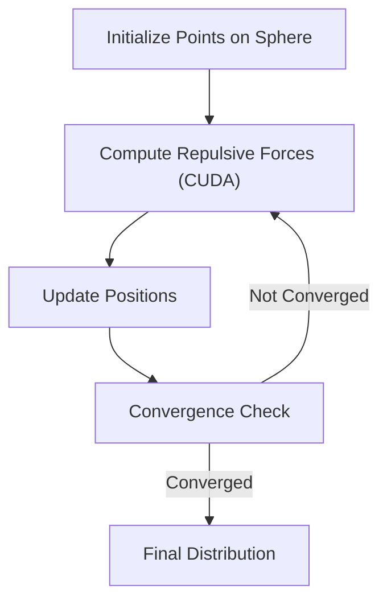
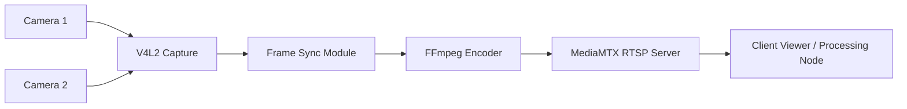

**Embedded Systems Engineer • Scientific Computing Specialist • R&D Platform Architect**  
_Firmware + Drivers • Real-Time Sensing • HPC Optimization • Applied AI_

I design and build the low-level software that makes hardware intelligent — from kernel drivers and real-time sensor pipelines to GPU-accelerated scientific computing. I'm most at home where firmware meets physics and where careful engineering turns complex systems into reliable platforms.

---

# What I Do

I build intelligent, resilient systems at the intersection of **embedded firmware**, **real-time sensing**, and **scientific computing**. My work focuses on:

- **Embedded Linux drivers** and hardware integration (I2C, SPI, UART, CAN)  
- **Real-time video + sensor acquisition pipelines** (GStreamer, V4L2, FFmpeg)  
- **AI/ML deployment** in constrained environments (PyTorch, CUDA)  
- **Scientific DevOps**: reproducible CI/CD, Docker, GitHub Actions  
- **HPC acceleration** with SIMD (AVX2), OpenMP, MPI, and custom CUDA kernels  

I specialize in projects requiring **low-level insight** and **high-level systems thinking**.

---

# Featured Projects {#projects}

Below are **project cards** with **architecture diagrams** (Mermaid) to illustrate system design and data flow.  
Repositories are private but **available upon request**.

## Spectral Radar Decomposition Driver (Kernel-Space)

Developed a Linux kernel driver for a radar module streaming high-rate ADC data via DMA into real-time FFT engines.

**Impact:**  
Enabled low-latency RF signal capture and spectral decomposition for imaging and diagnostics.

**Results:**  
Zero-copy DMA transfer via `mmap` ring buffer, sustaining continuous ADC streaming without frame drops at full sample rate.

**Tech:**  
C, Kernel Modules, DMA, mmap, FFTW

**Repo:** Private — available upon request

## Sphere Point Distribution for Agent Initialization

Generated uniform and quasi-uniform spherical distributions using Fibonacci, geodesic, and Lissajous curves with CUDA-accelerated force modeling.

**Impact:**  
Optimized initialization for agent-based simulations and volumetric analysis.

**Results:**  
Achieved near-uniform point distributions on the sphere with GPU-accelerated electrostatic relaxation, orders of magnitude faster than CPU-only baselines.

**Tech:**  
CUDA, Python, AVX2, Matplotlib

**Repo:** Private — available upon request

## Multi-Camera Real-Time Pipeline (V4L2 + RTSP)

Built synchronized multi-camera acquisition with low-latency streaming via MediaMTX.

**Impact:**  
Supports embedded vision applications on constrained compute platforms.

**Results:**  
Synchronized multi-stream capture with frame-accurate alignment, delivered at low latency over RTSP for downstream processing.

**Tech:**  
V4L2, FFmpeg, MediaMTX, GStreamer

**Repo:** Private — available upon request

## Disaster Image Severity Classification (CNNs)

Fine-tuned convolutional models to classify damage severity from crisis imagery.

**Impact:**  
Explored multimodal cues for humanitarian response modeling.

**Results:**  
Compared fine-tuned CNN architectures (ResNet, EfficientNet) with transfer learning to classify damage severity across multiple disaster categories.

**Tech:**  
PyTorch, TensorFlow, NumPy, OpenCV

**Repo:** [github.com/fractalclockwork/Data200](https://github.com/fractalclockwork/Data200)

---

# Technical Focus Areas {#skills}

- **Embedded:** Yocto, Buildroot, RTOS, V4L2, DMA, Device Trees  
- **Firmware:** I2C, SPI, UART, CAN, timing/synchronization, motion control  
- **Build & Test:** Make, CMake, cross-compilation toolchains, LabGrid, reproducible builds  
- **Signal Processing:** sensor fusion, precision measurement, filtering  
- **HPC:** OpenMP, MPI, AVX2, CUDA kernels, numerical methods  
- **AI/ML:** PyTorch, TensorFlow, ONNX, OpenCV, real-time vision pipelines  
- **Instrumentation:** network analyzers, oscilloscopes, RF signal generators, automated lab workflows  
- **CI/CD:** Docker, Jenkins, GitHub Actions, automated artifact packaging  
- **Debugging:** system-level profiling, hardware integration, performance tuning  
- **Visualization:** Matplotlib, VTK, Mayavi  

---

# Education {#education}

- **M.S., Molecular Science & Software Engineering** — UC Berkeley _(2026)_  
- **Certificate, Applied Data Science** — MIT _(2023)_  
- **Open University, College of Science & Engineering** — SFSU _(1999–2021)_  
- **B.S., Electronics Engineering Technology** — Hamilton Technical College _(1993)_  

---

# Experience {#experience}

### Freelance Research Engineer _(2018–Present)_
- Designed and implemented Linux kernel drivers for radar and imaging hardware, including DMA-based high-rate ADC capture
- Built real-time multi-camera acquisition pipelines (V4L2, GStreamer, RTSP) for embedded vision platforms
- Developed CUDA-accelerated scientific computing tools for agent-based simulation and volumetric analysis
- Designed CI/CD automation for embedded Linux targets using Docker, GitHub Actions, and LabGrid workflows
- Coordinated with hardware engineers to integrate analog/digital subsystems and negotiate design trade-offs

### Senior HW/SW R&D Engineer — Grid Net _(2013–2018)_
- Led firmware and driver development for smart-grid metering modem platforms deployed across utility networks
- Wrote and maintained Linux kernel modules for custom communication hardware (SPI, UART, CAN)
- Owned board bring-up, bootloader configuration, and Yocto-based BSP integration for ARM-based field devices
- Established reproducible build environments, cross-compilation toolchains, and automated artifact packaging
- Guided cross-functional collaboration among firmware, hardware, and test engineering groups

### Design Engineer — Embedded Systems Consultant _(2011–2013)_
- Built embedded medical and wearable systems integrating precision bioelectrical sensing and real-time signal processing
- Designed hardware prototypes using CAD, CNC machining, and custom PCB development
- Developed the system described in US patent application 61834836 for bioelectrical signal processing

### Systems & Integration Engineer — OpenTV _(2004–2011)_
- Developed embedded Linux software for broadband set-top boxes and interactive media platforms
- Integrated protocol stacks (MPEG-TS, DVB, IP) across middleware and hardware abstraction layers
- Collaborated with silicon vendors on driver development and system-level performance tuning  

---

# Patents {#patents}

- **US 61834836** — System for Optimal Physical Exercise and Training _(Filed Jun 13, 2013)_  
  Developed a system for processing, displaying, and comparing bioelectrical signals.

---

# Contact {#contact}

- [bathorne@berkeley.edu](mailto:bathorne@berkeley.edu)  
- [LinkedIn](https://www.linkedin.com/in/brent-thorne-a581554)  
- [GitHub Pages](https://fractalclockwork.github.io)  
- [Resume (PDF)](/assets/Brent_Thorne_Resume.pdf)

---

> _"Simple systems can grow complex behavior. Complex systems require careful simplicity."_
